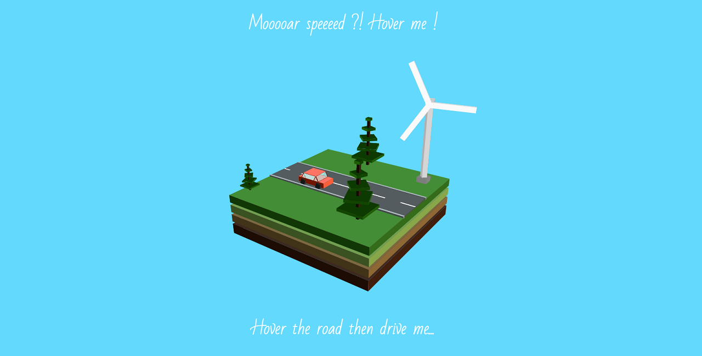

Devoir Transitions Animations Transformations 15/10/2017
========================================================
> *Par Edouard HABERER H2 G2 P2021*

# Simple Road #

**Simple road** est une expérience 3D interactive réalisée uniquement à partir d'```HTML``` et de ```CSS```.



Le monde 3d contient sur son terrain :

  - 1 voiture pouvant être *dirigée*
  - 6 arbres
  - 2 lampadaires
  - 1 éolienne

L'ensemble de ces éléments est animé de sorte à donner l'impression que la voiture évolue sur une route sans fin, diverses interactions sont possibles pour l'utilisateur avec la page.

# Features #

- Interactions :
  - Possibilité de passé de la vue "de base" à une vue à la 3ème personne en survolant le terrain
  - Une fois en vue 3ème personne, possibilité de conduire la voiture de gauche à droite en survolant la partie droite ou gauche de l'écran
  - Possibilité de passer en mode "grande vitesse" en survolant le texte au-dessus du terrain : *(Mooooar speeeed ?! Hover me !)*

- Environnement :
  - Entrée du terrain animé lors de l'arrivée sur la page
  - Cycle jour / nuit de 30s par phase (15 pour le premier cycle jour)
  - Lampadaires fonctionnels : la lumière passe de gris (jour) à jaune (nuit) pour signaler que l'ampoule est allumée
  - Éolienne animée

# Ressources utilisées #

- HTML 5
- CSS 3
- Google Fonts
- ~~JavaScript~~
  - En effet JavaScript n'a pas été utilisé dans le but de rester un maximum dans les bornes de l'exercice, bien que dans certains cas cela aurait pu être plus pertinent *(par exemple pour simplifier la méthode permettant d'activer le mode "grande vitesse" et la rendre plus facilement compréhensible pour un autre dev.).*

# Remarques #

L'ensemble de l'environnement 3D se base sur une méthode à laquelle j'ai pensé suite à votre premier cours cette année. Ainsi à chaque fois que je crée un nouveau cube je ne le recrée pas en saisissant ses dimensions, mais en redimensionnant un *cube de base*.

De plus afin d'animer mes éléments à partir d'un point **A** tout en les construisant depuis un point **B** j'englobe l'ensemble de mes faces dans deux ```<div>``` (*.nomElementNode* et *.nomElementBlock* pour les classes) de sorte à d'abord positionner le point **A** (qui servira pour les animations de l'élément et de ses enfants) puis de positionner le point **B** pour créer l'élément à partir de celui-ci (cela me permet aussi de plus ou moins outrepasser le fait que la propriété ```transform``` ne peut être cumulée sur un seul élément, évitant ainsi de réciter toutes les propriétés de ```transform``` en cas d'animation).

<sup>Ce n'est certainement pas très clair pour le passage ci-dessus ça l'est peut être un peu plus dans le code, je m'en excuse.</sup>

De par la complexité relative de l'environnement 3D vis-à-vis de la méthode utilisée pour le mettre en place j'ai pu expérimenter les limites de cette dernière (principalement sous Firefox). Ainsi pour limiter l'impact sur les performances la majorité des faces *non visibles* pour l'utilisateur ne sont tout simplement pas existantes.

# Compatibilité #
- ***Google Chrome*** <sup>*(testé sous la version 61)*</sup> : Compatible
  - Note : ensemble fluide avec 60fps constant, quelques chutes aux alentours de 40fps

- ***Firefox*** <sup>*(testé sous la version 56)*</sup> : Compatible
  - Note : problème de performance (sans doute dû au moteur de rendu) environ 40fps et chutes fréquentes <10fps

- ***Opera*** <sup>*(testé sous la version 48)*</sup> : Compatible
  - Note : ensemble fluide avec 60fps constant, quelques chutes aux alentours de 40fps

- ***Internet Explorer*** <sup>*(testé sous la version 11)*</sup>  : Non compatible
  - Note : La 3D est perdue car [transform-style: preserve-3d](https://caniuse.com/#search=perspective) n'est pas supporté

- ***Edge*** : Non testé
- ***Safari*** : Non testé
